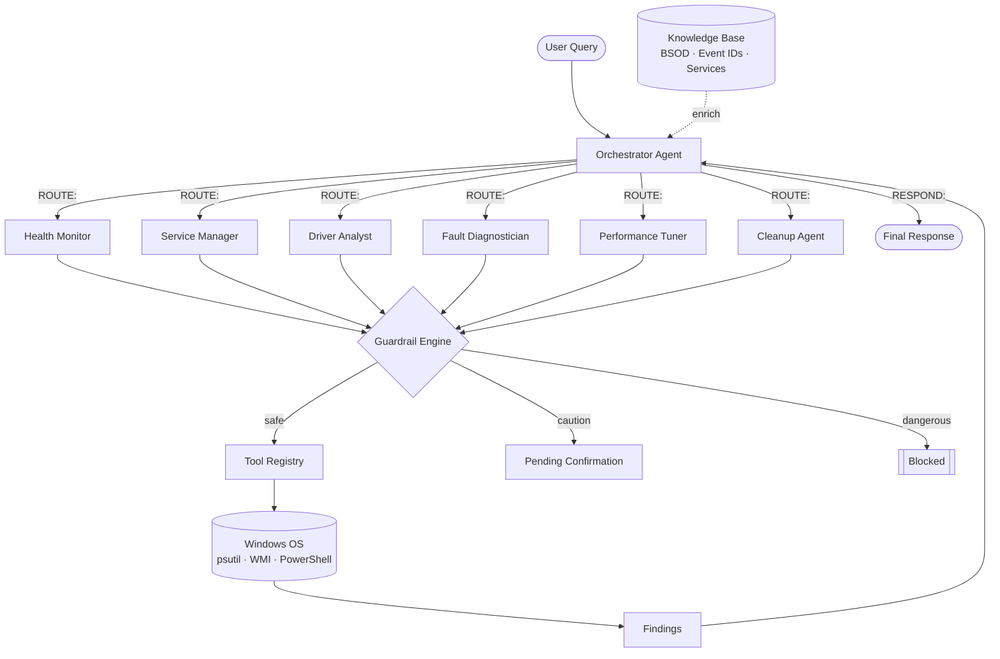
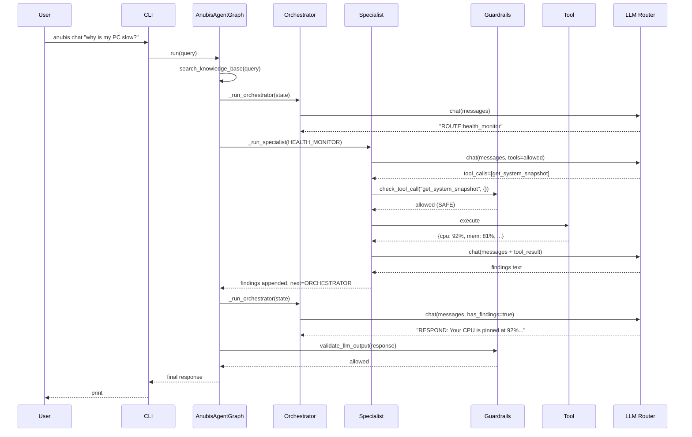

# Anubis — PC Guardian

> [!abstract] TL;DR
> **Anubis** is an open-source, **local-first** Windows PC optimization assistant. A **supervisor agent** routes user queries to one of six **specialist sub-agents**, each scoped to a narrow domain (health, services, drivers, faults, performance, cleanup). LLM inference runs on **Ollama** by default, with optional cloud failover to **Groq** via a multi-provider router. Safety is enforced by a five-layer **guardrail engine** and a knowledge base seeded with BSOD codes, event IDs, and service references.

Entry points: [[#Architecture]] · [[#Agent Roster]] · [[#Tool Catalog]] · [[#Safety Model]] · [[#LLM Router]] · [[#Configuration]] · [[#Runtime Surfaces]]

---

## Architecture



The orchestration uses a **supervisor pattern** over [[LangGraph]]. The orchestrator only decides routing or emits the final response — specialists are the only agents that call tools. State flows through a single `AgentState` object with a hard iteration cap (`max_iterations = 6`).

> [!info] Source of truth
> Orchestrator & specialist loop: `src/anubis/agents/graph.py`
> Shared state + role prompts: `src/anubis/agents/base.py`

---

## Agent Roster

| Agent | Role Enum | Domain | Tools (allow-list) |
|---|---|---|---|
| [[#Orchestrator]] | `ORCHESTRATOR` | Routing / synthesis | — (never calls tools) |
| [[#Health Monitor]] | `HEALTH_MONITOR` | CPU / mem / disk / net | `get_system_snapshot`, `get_cpu_info`, `get_memory_info`, `get_disk_info` |
| [[#Service Manager]] | `SERVICE_MANAGER` | Windows services | `get_services`, `get_failed_services`, `restart_service`, `identify_bloatware_services` |
| [[#Driver Analyst]] | `DRIVER_ANALYST` | Driver health | `get_all_drivers`, `get_problem_drivers`, `get_driver_summary` |
| [[#Fault Diagnostician]] | `FAULT_DIAGNOSTICIAN` | Event logs / BSOD | `get_recent_errors`, `get_bsod_events`, `get_crash_dumps`, `get_event_log_summary` |
| [[#Performance Tuner]] | `PERFORMANCE_TUNER` | Boot / power / startup | `get_power_plans`, `set_power_plan`, `get_memory_diagnostics`, `get_system_boot_time`, `get_startup_programs` |
| [[#Cleanup Agent]] | `CLEANUP_AGENT` | Temp files / DNS | `scan_temp_files`, `clean_temp_files`, `flush_dns_cache`, `get_recycle_bin_size` |

### Orchestrator
Uses a strict routing protocol: must reply with either `ROUTE:<agent>` or `RESPOND:<text>`. After any specialist returns findings, the orchestrator is forced into `RESPOND:` mode to prevent multi-specialist chains. See `AGENT_SYSTEM_PROMPTS[ORCHESTRATOR]` in `agents/base.py`.

### Health Monitor
Reports system vitals with specific numbers. Uses `psutil` under the hood via `tools/system_health.py`.

### Service Manager
Audits auto-start services, detects bloatware, and can restart a failed service (confirmation-gated). Cross-references [[#Knowledge Base]] `services_reference.py` for plain-English descriptions.

### Driver Analyst
Surfaces outdated / unsigned / problem drivers with device name + current version. Backed by WMI queries in `tools/drivers.py`.

### Fault Diagnostician
Parses Windows event logs and crash dumps, correlates patterns, and enriches output using the [[#Knowledge Base]] BSOD code & event ID tables.

### Performance Tuner
Switches power plans, enumerates startup programs, analyzes boot time, runs memory diagnostics. `set_power_plan` is **caution** — requires confirmation.

### Cleanup Agent
Always scans first, then deletes. `clean_temp_files` is **caution**; all read-only scans are safe.

---

## Tool Catalog

All tools live in `src/anubis/tools/` and are registered with `ToolRegistry` (`src/anubis/llm/tool_registry.py`), which serializes them into Ollama / OpenAI tool-use format.

| Module | Purpose |
|---|---|
| `system_health.py` | CPU, memory, disk, network snapshots (psutil) |
| `services.py` | Windows service enumeration & control |
| `drivers.py` | Driver inventory via WMI |
| `event_logs.py` | Event log querying, BSOD & crash dump parsing |
| `performance.py` | Power plans, startup programs, boot time |
| `processes.py` | Top processes, per-process detail |
| `disk_health.py` | SMART data via `pySMART` |
| `cleanup.py` | Temp file scanning & cleanup, DNS flush |
| `restore_point.py` | System Restore point creation (pre-destructive actions) |

> [!tip] Tool selection is *enforced*
> Each specialist only sees tools in its allow-list (`AGENT_TOOLS` in `graph.py`). The LLM cannot call tools outside its scope even if it tries.

---

## Safety Model

Implemented in `src/anubis/core/guardrails.py`. Five layered defenses, in order:

> [!warning] Defense in depth
> 1. **Risk classification** — every tool mapped to `SAFE`, `CAUTION`, or `DANGEROUS` in `TOOL_RISK_MAP`.
> 2. **Confirmation gates** — `CAUTION` tools produce a `pending_confirmation` payload instead of executing.
> 3. **Blocklists** — regex patterns for paths, services, and commands that are *never* touched (e.g. `System32`, `winlogon`).
> 4. **Output validation** — every LLM response passes `validate_llm_output()` before reaching the user.
> 5. **Action logging** — `ActionRecord` rows provide an audit trail (agent, tool, args, risk, approved, result).

Related: [[AgentConfig]] has `enable_auto_fix: false` by default and `create_restore_points: true`, so destructive actions both require confirmation *and* a System Restore point.

---

## LLM Router

Source: `src/anubis/llm/router.py` (≈500 lines).

- **Priority order** (configurable): `["ollama", "groq"]` — first available wins.
- **Retry** with backoff (`max_retries_per_provider`, `retry_delay_seconds`).
- **Circuit breaker** opens after `circuit_breaker_threshold` consecutive failures; resets after `circuit_breaker_reset_seconds`.
- **Unified `LLMResponse`** wraps content, tool_calls, provider, model, latency, error — specialists read `.ok`, `.has_tool_calls`, `.to_message_dict()` regardless of backend.
- **API compat**: both providers speak OpenAI-compatible chat completions. Groq returns tool arguments as JSON *strings*, which `graph.py` normalizes before dispatch.

> [!note] Why two providers?
> Ollama keeps the happy path 100% local. Groq is a fast, free-tier failover when local inference is slow or unavailable — e.g. during bursty diagnostics.

---

## Knowledge Base

`src/anubis/knowledge/` is a static, curated reference used to enrich specialist prompts:

- `bsod_codes.py` — STOP codes → human-readable causes
- `event_ids.py` — Windows event IDs → meaning + severity
- `services_reference.py` — Windows services → purpose, safe-to-disable flag
- `lookup.py` — `search_knowledge_base(query)` returns the most relevant entries, filtered per-agent by `_kb_relevant_to_agent` (e.g. fault diagnostician sees BSOD + event IDs, service manager sees services).

The orchestrator injects KB context into the initial message; specialists inject filtered KB context into their system prompt.

---

## Configuration

Config is a Pydantic `AnubisConfig` (see `src/anubis/core/config.py`), loaded from `anubis.yaml`. Run `anubis init` to materialize defaults.

```yaml
ollama:
  host: http://localhost:11434
  model: qwen3:14b
  temperature: 0.1
  context_length: 32768

groq:
  api_key: ""   # or set GROQ_API_KEY
  model: meta-llama/llama-4-scout-17b-16e-instruct
  fallback_model: qwen/qwen3-32b

llm_router:
  provider_priority: [ollama, groq]
  circuit_breaker_threshold: 5

monitoring:
  poll_interval_seconds: 30
  cpu_alert_threshold: 90.0
  enable_watchdog: true
  watchdog_interval_minutes: 5

agents:
  orchestrator_mode: supervisor
  max_agent_iterations: 10
  enable_auto_fix: false
  create_restore_points: true

api:
  host: 127.0.0.1
  port: 8484
```

---

## Runtime Surfaces

### CLI — `anubis ...`
`src/anubis/cli/main.py` (Typer + Rich):

| Command | Purpose |
|---|---|
| `anubis init` | Write default `anubis.yaml` |
| `anubis scan` | One-shot system scan |
| `anubis chat` | Interactive REPL against the agent graph |
| `anubis serve` | Launch the FastAPI dashboard |

### HTTP API — FastAPI
`src/anubis/api/app.py` serves a dashboard (HTMX + DaisyUI dark theme) and these JSON endpoints:

| Method | Path | Description |
|---|---|---|
| GET | `/health` | Ollama / Groq connectivity |
| POST | `/chat` | Submit a query to the agent graph |
| GET | `/snapshot` | Real-time system snapshot |
| GET | `/services` | All Windows services |
| GET | `/services/failed` | Failed auto-start services |
| GET | `/drivers/summary` | Driver health summary |
| GET | `/events/errors` | Recent error events |
| GET | `/disks/health` | SMART health data |
| GET | `/processes/top` | Top resource-consuming processes |
| GET | `/cleanup/scan` | Cleanable temp files (dry-run) |

### Watchdog
`src/anubis/core/watchdog.py` runs scheduled scans (hourly event scan, daily health report) when `monitoring.enable_watchdog = true`.

### Database
`src/anubis/db/` — SQLAlchemy + `aiosqlite`. Default DSN `sqlite+aiosqlite:///anubis_telemetry.db`. Stores telemetry time-series and guardrail audit log.

---

## Tech Stack

| Layer | Libraries |
|---|---|
| Orchestration | [[LangGraph]], `langchain-core` |
| LLM clients | `langchain-ollama`, `ollama`, `httpx` (Groq) |
| System | `psutil`, `wmi`, `pywin32`, `pySMART` |
| API | `fastapi`, `uvicorn[standard]`, `jinja2` |
| CLI | `typer`, `rich` |
| Data | `pydantic`, `sqlalchemy`, `aiosqlite`, `pyyaml` |
| Logging | `structlog` |
| Dev | `pytest`, `pytest-asyncio`, `ruff`, `mypy` (strict) |

---

## Model Recommendations

| Model | Size | VRAM | Best For |
|---|---|---|---|
| `qwen3:14b` | ~8 GB | 10 GB+ | Best overall tool-calling |
| `qwen3:7b` | ~4 GB | 6 GB+ | Balanced |
| `mistral:7b` | ~4 GB | 6 GB+ | Fast, solid tools |
| `command-r:35b` | ~20 GB | 24 GB+ | Best quality, big GPU |

Tool-calling support is a hard requirement — specialists rely on function-call payloads.

---

## Repository Map

```
Anubis/
├── src/anubis/
│   ├── agents/       # graph.py, base.py - supervisor + specialists
│   ├── api/          # FastAPI app + HTMX templates
│   ├── cli/          # Typer CLI entry point
│   ├── core/         # config, guardrails, logging, watchdog
│   ├── db/           # SQLAlchemy engine + models
│   ├── knowledge/    # BSOD / event-ID / service reference tables
│   ├── llm/          # router, ollama_client, tool_registry
│   └── tools/        # system_health, services, drivers, event_logs, ...
├── tests/            # pytest suites mirroring src layout
├── anubis.yaml.example
├── pyproject.toml    # hatchling build, [project.scripts] anubis = ...
├── start_server.py
└── README.md
```

Total Python: ~5.6k LOC.

---

## Request Lifecycle (happy path)



---

## Development Workflow

```bash
pip install -e ".[dev]"   # install + dev deps
pytest                    # run tests (asyncio_mode = auto)
ruff check src/           # lint (E, F, I, N, W, UP)
mypy src/                 # strict type-check
```

Test layout mirrors source: `tests/agents/`, `tests/api/`, `tests/llm/`, `tests/tools/`, plus standalone `test_config.py`, `test_guardrails.py`, `test_knowledge.py`.

---

## Key Invariants

> [!important] Do not violate
> - **Single-specialist-per-query**: orchestrator forced to `RESPOND:` once any findings exist.
> - **Tool allow-list**: specialists only see tools in their `AGENT_TOOLS[role]` entry.
> - **Iteration cap**: `AgentState.max_iterations = 6` (module default) / `agents.max_agent_iterations = 10` (config) — whichever is lower.
> - **Every tool call is classified**: missing entries in `TOOL_RISK_MAP` should default to `DANGEROUS`.
> - **No cloud dependency by default**: Groq is opt-in via API key; Ollama is first in priority.

---

## Related Notes

- [[LangGraph]] — upstream orchestration library
- [[Ollama]] — local LLM runtime
- [[Groq]] — fallback cloud provider
- [[Windows Event IDs]] — knowledge base reference
- [[BSOD Codes]] — knowledge base reference
- [[Pydantic]] — config & state schemas

#project/anubis #windows #llm #multi-agent #safety
